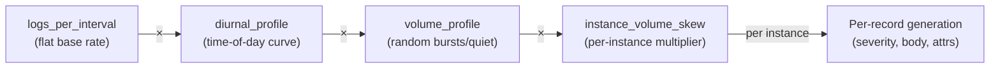
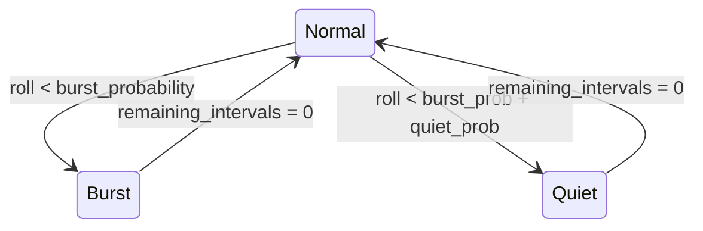

# Log Generation Tuning Guide

Explains every tunable parameter of the log generator and how they interact.
For humans configuring benchmarks and LLMs assisting with configuration.

## 1. The Log Generation Pipeline

Each log scenario produces records through a layered pipeline:



The effective number of log records per instance per interval is:

```
effective_logs = logs_per_interval × diurnal_multiplier(currentTime) × volume_multiplier(rng) × instance_multiplier[i]
```

The `instance_multiplier` is pre-computed once at init from the global seed using a log-normal distribution
controlled by `instance_volume_skew` (sigma). When `instance_volume_skew` is 0 (default), all multipliers are 1.0.

Each record then receives:
- **Severity** selected from `severity_weights`
- **Body** from a message template matched by severity
- **Record attributes** from the template's `Attrs` / `AttrFromArg` (varies per template)
- **Resource attributes** from the YAML resource-attributes template (varies per service)

---

## 2. Volume Shaping

### 2a. `diurnal_profile` — Time-of-Day Curve

Applies a **deterministic** multiplier based on the simulated `currentTime` (not wall clock).
Uses a smooth cosine interpolation between peak and trough hours.

**Parameters:**

- `peak_hour` (0–23, default `14`): hour with maximum traffic
- `trough_hour` (0–23, default `4`): hour with minimum traffic
- `peak_multiplier` (default `3.0`): multiplier at peak hour
- `trough_multiplier` (default `0.2`): multiplier at trough hour
- `cron_bursts`: optional list of periodic batch-job spikes (see below)

**The cosine curve:**

```
multiplier
  3.0 |          .......
      |        ..       ..
      |      ..           ..
  1.6 |    ..               ..              ← midpoint ≈ (peak+trough)/2
      |  ..                   ..
      |..                       ..
  0.2 |                          .........
      +---+---+---+---+---+---+---+---+---→ hour
      04  07  10  13  14  17  20  23  04
      trough          peak          trough
```

The formula maps each hour to an angle on a cosine wave:
- At `peak_hour`: angle = 0, cos(0) = 1 → returns `peak_multiplier`
- At `trough_hour`: angle = π, cos(π) = -1 → returns `trough_multiplier`
- Halfway between: cos(π/2) = 0 → returns the midpoint `(peak + trough) / 2`

**Cron bursts** layer periodic spikes on top of the cosine curve:

```yaml
cron_bursts:
  - interval: 15m       # burst repeats every 15 minutes
    multiplier: 5.0     # 5x spike
    duration: 1m        # burst lasts 1 minute
  - interval: 1h
    multiplier: 10.0
    duration: 2m
```

When `currentTime` falls within a burst window (`time mod interval < duration`),
the effective multiplier is `max(diurnal_value, cron_burst_multiplier)`.
Cron bursts never reduce the diurnal baseline — they only spike above it.

**Important**: the diurnal curve operates on simulated time. A `start_now_minus: 1h`
window only covers ~1 hour of the 24h cycle, so you'll see minimal variation.
Use `start_now_minus: 24h` or longer to see the full diurnal effect.

**Tuning guidance:**

| Goal | `peak_multiplier` | `trough_multiplier` | Ratio |
|------|-------------------|---------------------|-------|
| Subtle day/night | 1.5 | 0.5 | 3:1 |
| Moderate (typical SaaS) | 3.0 | 0.2 | 15:1 |
| Dramatic (e-commerce) | 5.0 | 0.1 | 50:1 |

The ratio `peak / trough` determines how extreme the swing is.

### 2b. `volume_profile` — Probabilistic Bursts and Quiet Periods

Introduces **random** volume variation using a simple state machine.
Each interval, when not already in a burst or quiet period, the generator rolls a random
number to decide whether to enter one.

**State transitions:**



**Parameters:**

| Parameter | Type | Description |
|-----------|------|-------------|
| `burst_probability` | 0.0–1.0 | Chance of entering a burst each interval |
| `burst_multiplier_min` | float | Minimum multiplier during a burst |
| `burst_multiplier_max` | float | Maximum multiplier during a burst (actual chosen uniformly in [min, max]) |
| `burst_duration_min` | int | Minimum consecutive intervals a burst lasts |
| `burst_duration_max` | int | Maximum consecutive intervals a burst lasts |
| `quiet_probability` | 0.0–1.0 | Chance of entering a quiet period each interval |
| `quiet_multiplier` | float | Multiplier during quiet (e.g. `0.2` = 20% of baseline) |
| `quiet_duration_min` | int | Minimum consecutive intervals a quiet period lasts |
| `quiet_duration_max` | int | Maximum consecutive intervals a quiet period lasts |

`burst_probability + quiet_probability` must not exceed 1.0.

**Tuning guidance:**

- `burst_probability: 0.05` means roughly 1 burst every 20 intervals on average
- Duration is in intervals: `burst_duration_max: 8` with `interval: 5s` = 40 seconds max
- The multiplier range `[min, max]` creates variety between bursts
- `quiet_multiplier: 0.2` simulates overnight/maintenance lulls

### 2c. `instance_volume_skew` — Per-Instance Volume Variation

Applies a **deterministic** per-instance multiplier so that not all pod replicas emit
the same amount of logs. Uses a log-normal distribution seeded once at init.

**Parameter:**

- `instance_volume_skew` (float, default `0`): sigma of the underlying normal distribution

| `instance_volume_skew` | Effect |
|------------------------|--------|
| 0 | Flat — all instances emit the same volume |
| 1.0 | Moderate variation — instances range from ~0.3x to ~3x base rate |
| 1.5 | Wide spread — instances range from ~0.1x to ~5x base rate |
| 2.0 | Extreme — a few "hot" pods dominate the log volume |

Multipliers are normalized so the mean is 1.0 — total volume is preserved,
but it is redistributed unevenly across instances. This mirrors production
behavior where a small number of pods handle disproportionate traffic.

```yaml
instance_volume_skew: 1.5   # wide variation across 120 nginx pods
```

### 2d. How They Compose

Diurnal shapes the baseline; volume_profile adds random variance;
instance_volume_skew redistributes volume across pods:

```
effective_logs = logs_per_interval × diurnal × volume × instance_multiplier[i]
```

**Worked example** with `logs_per_interval: 50`:

| Time of day | Diurnal mult | Volume state | Volume mult | Effective logs |
|-------------|-------------|--------------|-------------|----------------|
| 14:00 (peak) | 3.0 | Normal | 1.0 | 150 |
| 14:00 (peak) | 3.0 | Burst (5x) | 5.0 | 750 |
| 04:00 (trough) | 0.2 | Normal | 1.0 | 10 |
| 04:00 (trough) | 0.2 | Burst (5x) | 5.0 | 50 |
| 04:00 (trough) | 0.2 | Quiet (0.2x) | 0.2 | 2 |
| 09:00 (mid) | ~1.6 | Normal | 1.0 | 80 |

Bursts scale with the diurnal baseline: a 5x burst at peak (3.0x) produces 15x
the base rate, while the same burst at trough (0.2x) produces only 1x.

All three volume-shaping features are independently optional — when omitted, each
multiplier defaults to 1.0.

---

## 3. Severity Distribution

The `severity_weights` parameter overrides the profile's default severity distribution.
It is an array of 6 **cumulative** percentages for `[TRACE, DEBUG, INFO, WARN, ERROR, FATAL]`.

**How to read the array:**

```yaml
severity_weights: [0, 2, 87, 94, 99, 100]
```

| Index | Level | Cumulative | Individual % |
|-------|-------|------------|-------------|
| 0 | TRACE | 0 | 0% |
| 1 | DEBUG | 2 | 2% (2 - 0) |
| 2 | INFO | 87 | 85% (87 - 2) |
| 3 | WARN | 94 | 7% (94 - 87) |
| 4 | ERROR | 99 | 5% (99 - 94) |
| 5 | FATAL | 100 | 1% (100 - 99) |

The last value must be `100`. Values must be non-decreasing.

**Tuning examples:**

```yaml
# Production-like (default)
severity_weights: [0, 2, 87, 94, 99, 100]

# High-error stress test
severity_weights: [0, 0, 50, 65, 90, 100]
# INFO 50%, WARN 15%, ERROR 25%, FATAL 10%

# Debug-heavy (troubleshooting simulation)
severity_weights: [5, 30, 80, 90, 98, 100]
# TRACE 5%, DEBUG 25%, INFO 50%, WARN 10%, ERROR 8%, FATAL 2%

# INFO-only (minimal noise)
severity_weights: [0, 0, 100, 100, 100, 100]
```

When omitted, the profile default is used: `[0, 2, 87, 94, 99, 100]`.

---

## 4. IP Pool Configuration

The `ip_pool` block configures the IP address pool used for `net.peer.ip` and similar fields
in nginx, mysql, redis, and proxy profiles.

**Parameters:**

- `cidrs`: list of IPv4 CIDR ranges to draw IPs from (default: `["10.0.0.0/8"]`)
- `zipf_skew`: the Zipf distribution `s` parameter, must be > 1.0 (default: `1.5`)

The pool size is auto-derived from `scale * 10` (minimum 500).

**How the Zipf distribution works:**

IPs are pre-generated into a pool, then selected using a Zipf (power-law) distribution.
The most "popular" IP gets selected far more often than the least popular one.

| `zipf_skew` | Effect |
|-------------|--------|
| 1.1 | Nearly uniform — traffic spread evenly across IPs |
| 1.5 | Moderate skew — top 10% of IPs generate ~60% of traffic |
| 2.0 | Heavy skew — a few IPs dominate (realistic for bot/crawler traffic) |
| 3.0 | Extreme skew — useful for simulating DDoS-like concentration |

**Tuning examples:**

```yaml
# Default: large private subnet, moderate skew
# (no ip_pool block needed — this is the default)

# Multi-subnet with high skew (simulates multiple data centers)
ip_pool:
  cidrs: ["10.0.0.0/16", "172.16.0.0/12"]
  zipf_skew: 2.0

# Small pool, even distribution (simulates internal microservice mesh)
ip_pool:
  cidrs: ["10.0.1.0/24"]
  zipf_skew: 1.1
```

The pool is pre-generated deterministically from the seed, so results are reproducible.

---

## 5. Schema Variability

Different services emit different sets of resource and record-level attributes,
matching real-world Kubernetes deployments where workloads are managed differently.

### Resource attributes (per service)

| Service | Deployment model | Unique resource attributes | Notable differences |
|---------|-----------------|---------------------------|-------------------|
| nginx | Helm-managed ingress | `helm.sh/chart`, `managed-by: Helm`, `part-of` | Most labels — standard Helm deployment |
| goapp | CI/CD deployed | `telemetry.sdk.name`, `telemetry.sdk.language`, `team` label | No Helm labels — deployed via CI pipeline |
| mysql | Operator-managed | `managed-by: mysql-operator`, `mysql.oracle.com/cluster` | No `helm.sh/chart` or `part-of` |
| redis | Helm StatefulSet | `helm.sh/chart`, `managed-by: Helm`, `redis.io/role` | No `part-of`; has master/replica role |
| proxy | K8s Deployment per-AZ | Per-AZ `k8s.deployment.name`, `k8s.replicaset.name` | Per-AZ deployments; `cloud.*`, `host.*`, `os.type` are universal across all profiles |

### Record-level attributes (per template)

Not all log records carry the same attributes. Attributes vary by message template:

| Service | Attributes on some templates | Present on |
|---------|------------------------------|-----------|
| nginx | `http.response.body.size`, `http.flavor`, `user_agent.original`, `http.request.body.size` | Access log templates |
| goapp | `rpc.system`, `rpc.service`, `rpc.method` | gRPC call templates |
| goapp | `messaging.system`, `messaging.destination.name` | Worker/queue templates |
| mysql | `db.operation.name`, `db.sql.table` | Query-related templates |
| redis | `db.operation.name`, `net.peer.port` | Connection/command templates |
| proxy | `request_id`, `connection_id`, `action`, `routing_decision`, `status_reason`, `application_type`, `resolution_type`, `organization_id` | All templates (14 core on INFO, ~25 on WARN/ERROR) |
| proxy | `serverless.project.type`, `tls_version`, `tls_cipher`, `request_source`, `client_meta` | INFO templates (rare attrs, 3–30% presence) |

This creates a realistic multimodal field-count distribution across log records.

To customize schema variability, edit:
- **Resource attributes**: YAML templates in `logsgenreceiver/internal/logstmpl/builtin/`
- **Record attributes**: Go profile files in `logsgenreceiver/internal/loggen/`

---

## 6. Other Parameters

### Needles (fault injection)

Inject specific log messages at a controlled rate for testing alerting and search:

```yaml
needles:
  - name: upstream_timeout            # unique identifier
    message: "upstream timed out..."  # exact log body to inject
    rate: 0.002                       # probability per log record (0.0–1.0)
    severity: ERROR
    attributes:                       # optional extra attributes
      error.type: "timeout"
```

Needles replace an existing log record with the specified message. The `rate`
is checked per record, so `0.002` means ~0.2% of records become this needle.
Needle counts are reported at shutdown for verification.

### Trace context

```yaml
emit_trace_context: true   # supported by k8s-goapp and k8s-proxy profiles
```

When enabled, every log record from that scenario gets a random `trace_id` and `span_id`.
Supported by goapp and proxy profiles; has no effect on nginx, mysql, or redis.
Since all records in the enabled scenario get trace context, the overall presence
equals that scenario's share of total volume (e.g. proxy at ~40% → ~40% trace presence).

### Topology: `scale`, `concurrency`, `template_vars`

```yaml
scale: 30              # total pod instances to simulate
concurrency: 10        # parallel goroutines for generation
template_vars:
  nodes: 3             # k8s nodes (pods distributed across nodes)
  pods_per_node: 10    # pods per node (scale = nodes × pods_per_node)
```

- `scale` = total pod instances. Each gets its own resource attributes.
- `concurrency` > 0 enables parallel generation (scale must be divisible by concurrency).
- `template_vars.nodes` controls `k8s.node.name` cardinality.
- `template_vars.pods_per_node` controls pod density per node.
- Formula: `scale = nodes × pods_per_node`.
- Pods are assigned to nodes as `node = instanceID % nodes`, so overlapping
  node ranges across scenarios create realistic colocation (multiple services per node).

### Timing

- `interval`: time step between generation rounds (minimum `1s`)
- `interval_jitter_std_dev`: adds Gaussian jitter to per-record timestamps (e.g. `10ms`)
- `start_now_minus` / `start_time`: beginning of the simulated time window
- `end_now_minus` / `end_time`: end of the simulated time window

### Determinism

All random generation is seeded via the `seed` parameter. Same seed + same config = identical output.
The `diurnal_profile` is purely time-based (no RNG), so it's deterministic by construction.
The `volume_profile` uses the seeded RNG, so burst/quiet patterns are reproducible.

`start_now_minus` / `end_now_minus` make timestamps non-deterministic (wall-clock dependent);
log content remains reproducible.

---

## 7. Ready-to-Use Presets

### Flat Baseline

No volume shaping, default severity. Produces a constant rate of logs.

```yaml
scenarios:
  - path: builtin/k8s-nginx
    scale: 30
    logs_per_interval: 50
    concurrency: 10
    template_vars:
      nodes: 3
```

### Gentle Diurnal

Subtle day/night variation (3:1 ratio), no random bursts.

```yaml
scenarios:
  - path: builtin/k8s-nginx
    scale: 30
    logs_per_interval: 50
    concurrency: 10
    diurnal_profile:
      peak_hour: 14
      trough_hour: 4
      peak_multiplier: 1.5
      trough_multiplier: 0.5
    template_vars:
      nodes: 3
```

### Production-Like

Strong diurnal swing + moderate random bursts + periodic cron jobs + tuned IP pool.

```yaml
scenarios:
  - path: builtin/k8s-nginx
    scale: 30
    logs_per_interval: 50
    concurrency: 10
    diurnal_profile:
      peak_hour: 14
      trough_hour: 4
      peak_multiplier: 3.0
      trough_multiplier: 0.2
      cron_bursts:
        - interval: 15m
          multiplier: 5.0
          duration: 1m
        - interval: 1h
          multiplier: 8.0
          duration: 2m
    volume_profile:
      burst_probability: 0.05
      burst_multiplier_min: 2.0
      burst_multiplier_max: 5.0
      burst_duration_min: 4
      burst_duration_max: 12
      quiet_probability: 0.03
      quiet_multiplier: 0.2
      quiet_duration_min: 4
      quiet_duration_max: 16
    ip_pool:
      cidrs: ["10.0.0.0/16", "172.16.0.0/12"]
      zipf_skew: 2.0
    template_vars:
      nodes: 3
```

### API Gateway / Proxy

HTTP proxy access logs with production-calibrated distributions. The proxy profile
generates structured access logs with empty body (all data in attributes), matching
real API gateway behavior. Field values, status code distributions, and timing
percentiles are calibrated from production data.

```yaml
scenarios:
  - path: builtin/k8s-proxy
    scale: 24                     # 8 nodes × 3 pods/node
    logs_per_interval: 35
    concurrency: 8
    emit_trace_context: true      # proxy is trace-aware
    instance_volume_skew: 1.9     # realistic hot-pod skew
    template_vars:
      nodes: 8
      pods_per_node: 3
```

Key characteristics:
- **Empty body**: all data lives in record attributes (14 core on INFO, ~25 on WARN/ERROR)
- **Weighted distributions**: status codes (200=85%, 404=3.5%), methods (GET=43%, POST=38%), actions (bulk, search, security, etc.)
- **Log-normal timing**: response_time p50=2ms, proxy_internal_time_us p50=107µs
- **Rare attrs on INFO**: fields like `tls_version`, `client_meta`, `serverless.project.type` appear at 3–30% presence
- **Per-AZ topology**: resource attributes include `cloud.*`, `host.*`, per-AZ deployment names

### Stress Test

Extreme bursts, high-error severity, wide IP pool. Designed to push ingest pipelines.

```yaml
scenarios:
  - path: builtin/k8s-nginx
    scale: 100
    logs_per_interval: 200
    concurrency: 20
    severity_weights: [0, 0, 50, 65, 90, 100]
    diurnal_profile:
      peak_hour: 12
      trough_hour: 0
      peak_multiplier: 5.0
      trough_multiplier: 0.5
      cron_bursts:
        - interval: 5m
          multiplier: 10.0
          duration: 1m
    volume_profile:
      burst_probability: 0.15
      burst_multiplier_min: 5.0
      burst_multiplier_max: 15.0
      burst_duration_min: 8
      burst_duration_max: 30
      quiet_probability: 0.0
      quiet_multiplier: 1.0
      quiet_duration_min: 1
      quiet_duration_max: 1
    ip_pool:
      cidrs: ["10.0.0.0/8"]
      zipf_skew: 1.2
    template_vars:
      nodes: 20
```

---

## 8. Data Quality Evolution

Iteratively calibrated against sampled production documents.

### Before vs After (initial → RC10)

| Dimension | Initial (RC5) | RC10 (current) | Production |
|-----------|--------------|----------------|------------|
| **Overall realism score** | 4/10 | 8/10 | — |
| **Unique fields** | 47 | 130+ | 162 |
| **Field count mean** | 27.9 | 37+ | 44.6 |
| **Field count stddev** | 2.3 | 8.6 | 10.6 |
| **Field count p95** | 32 | 55 | 81 |
| **Fields below 1% presence** | 11 | 61+ | 97 |
| **Severity (INFO %)** | ~50% | ~82% | ~80–85% |
| **`error.message` presence** | 0% | ~60% | ~71% |
| **`error.message` max size** | — | ~79 KB | ~82 KB |
| **Stack trace mean / max** | — | ~1.6 KB / ~8.8 KB | ~3 KB / ~8.5 KB |
| **`request_id` cardinality** | 0 | ~22M | ~2.9M |
| **`request_path` cardinality** | 36 | ~16K | ~10K |
| **Token cardinality** | 37K | ~48K | 271 (narrow sample) |
| **body.text mean / max** | 172 B / 258 B | ~159 B / ~7.3 KB | 80 B / 811 B |
| **Cloud/infra field presence** | 0% | 100% | 100% |
| **Numeric field types** | 5 | 17+ | 17 |
| **`severity_text` presence** | 100% | ~65% | ~65% |
| **`trace_id` / `span_id` presence** | 0% | ~3% | ~3% |
| **Backend response time mean** | — | ~500 ms | ~424 ms |

### Key improvements by round

**RC5 → RC8** (realism 4/10 → 6/10):
- Added HTTP proxy / API gateway archetype with 30+ unique fields
- Added `error.message` (~60%) and `log.origin.stack_trace` (~20%) to all profiles
- Added 61 long-tail fields at <1% presence via schedule-based LongTailSet
- Rebalanced severity to 82% INFO, 0% FATAL
- Added Zipfian IP pools, realistic URL route templates, typed HTTP status codes
- Added `volume_profile` (burst/quiet state machine) and `diurnal_profile` (cosine curve)
- Added per-service resource attributes (different K8s labels per deployment model)

**RC8 → RC9** (realism 6/10 → 7/10):
- Fixed `request_id` cardinality: 4K → 22M (was 697x too low)
- Fixed `error.message` max size: 32 bytes → 79 KB
- Improved `request_path` cardinality: 35 → 1,908
- Improved stack traces: mean 842 B → 1,576 B
- Added `instance_volume_skew` for per-instance log volume variation
- Token cardinality +20% (40K → 48K)

**RC9 → RC10** (realism 7/10 → 8/10):
- Made `cloud.*`, `host.*`, `os.type`, `k8s.node.uid` universal (100% presence on all profiles)
- Calibrated `backend_response_time` mean from ~3,500 ms down to ~500 ms
- Moved `emit_trace_context` from goapp to proxy (~3% presence, matching production)
- Emitted `severity_text` on ~65% of records instead of 100%
- Moved `user_agent.original` to rare-attr at 31% on proxy INFO logs
- Increased stack trace frame caps (25→80 for Go, 30→80 for Java) for up to ~8.8 KB traces
- Clamped `route_connection_concurrency` and `route_request_concurrency` to production ranges
- Diversified `tls_cipher` weights (4 values instead of 2)
- Expanded dynamic URL path pool to 16,384 with 60/40 static/dynamic split
- Increased `handling_server` pool from 200 → 800

### Remaining known gaps

- **Document width**: production p95 = 81 fields vs generated p95 = 55 (would require new archetypes)
- **`data_stream` fields**: production has `data_stream.dataset`/`namespace`/`type` on every document; the generator relies on the ES exporter to derive these
- **Host/node cardinality**: 30 nodes vs production's 82 (configurable via `template_vars.nodes`)
- **`request_path` cardinality**: 16K generated vs 10K production — a strength for benchmark pressure

### Running the benchmark

Use `make bench` for a quick single-iteration benchmark (~1h of simulated data, ~5 services):

```bash
make bench
```

For a full-scale simulation (6h simulated, 30 nodes, ~56M logs), use the
`otelcol-logs-medium.yaml` configuration:

```bash
make install
./otelcol-dev/otelcol --config ./otelcol-logs-medium.yaml
```
